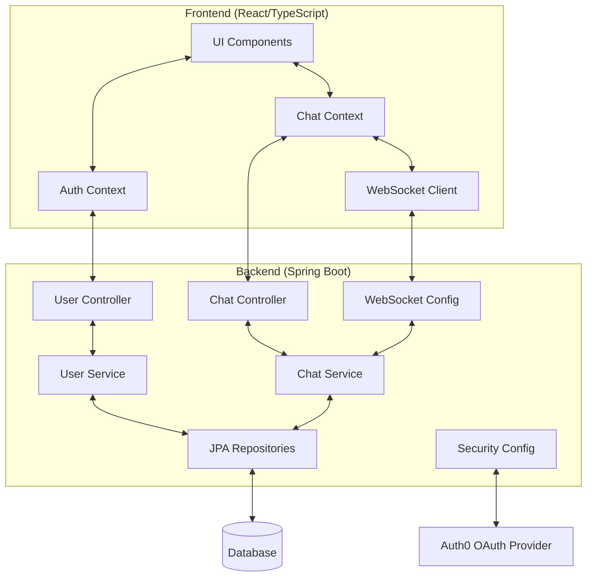
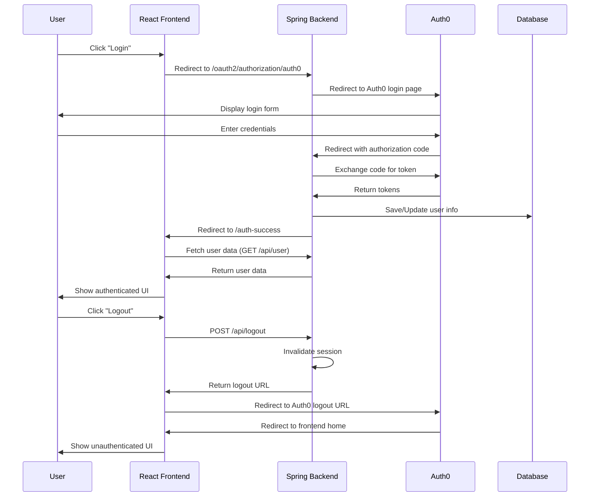
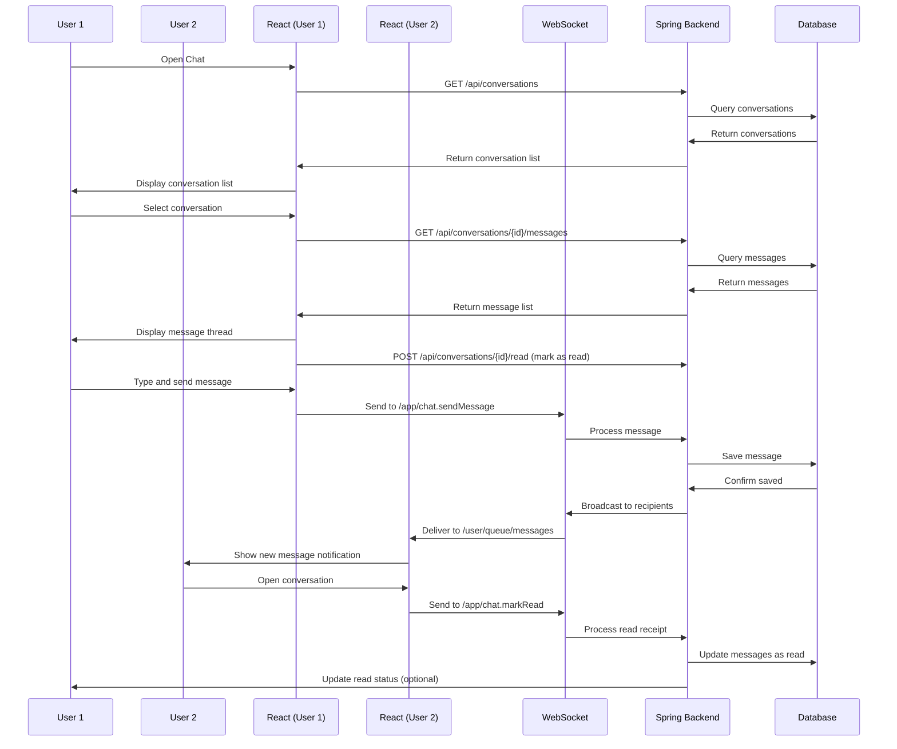

```mermaid
graph TB
    %% Client-Side Components
    subgraph "Frontend (React/TypeScript)"
        UI[UI Components]
        AuthContext[Auth Context]
        ChatContext[Chat Context]
        WebSocketClient[WebSocket Client]
    end
    
    %% Server-Side Components
    subgraph "Backend (Spring Boot)"
        SecurityConfig[Security Config]
        ChatController[Chat Controller]
        UserController[User Controller]
        ChatService[Chat Service]
        UserService[User Service]
        WebSocketConfig[WebSocket Config]
        JPA[JPA Repositories]
    end
    
    %% External Services
    Auth0[Auth0 OAuth Provider]
    
    %% Database
    DB[(Database)]
    
    %% Connections
    UI <--> AuthContext
    UI <--> ChatContext
    AuthContext <--> UserController
    ChatContext <--> ChatController
    ChatContext <--> WebSocketClient
    WebSocketClient <--> WebSocketConfig
    SecurityConfig <--> Auth0
    UserController <--> UserService
    ChatController <--> ChatService
    UserService <--> JPA
    ChatService <--> JPA
    JPA <--> DB
    WebSocketConfig <--> ChatService
```

```mermaid
sequenceDiagram
    participant User
    participant React as React Frontend
    participant Spring as Spring Backend
    participant Auth0
    participant DB as Database
    
    %% Login Flow
    User->>React: Click "Login"
    React->>Spring: Redirect to /oauth2/authorization/auth0
    Spring->>Auth0: Redirect to Auth0 login page
    Auth0->>User: Display login form
    User->>Auth0: Enter credentials
    Auth0->>Spring: Redirect with authorization code
    Spring->>Auth0: Exchange code for token
    Auth0->>Spring: Return tokens
    Spring->>DB: Save/Update user info
    Spring->>React: Redirect to /auth-success
    React->>Spring: Fetch user data (GET /api/user)
    Spring->>React: Return user data
    React->>User: Show authenticated UI
    
    %% Logout Flow
    User->>React: Click "Logout"
    React->>Spring: POST /api/logout
    Spring->>Spring: Invalidate session
    Spring->>React: Return logout URL
    React->>Auth0: Redirect to Auth0 logout URL
    Auth0->>React: Redirect to frontend home
    React->>User: Show unauthenticated UI
```

```mermaid
sequenceDiagram
    participant User1 as User 1
    participant User2 as User 2
    participant React1 as React (User 1)
    participant React2 as React (User 2)
    participant WS as WebSocket
    participant Spring as Spring Backend
    participant DB as Database
    
    %% Load Conversations
    User1->>React1: Open Chat
    React1->>Spring: GET /api/conversations
    Spring->>DB: Query conversations
    DB->>Spring: Return conversations
    Spring->>React1: Return conversation list
    React1->>User1: Display conversation list
    
    %% Select Conversation
    User1->>React1: Select conversation
    React1->>Spring: GET /api/conversations/{id}/messages
    Spring->>DB: Query messages
    DB->>Spring: Return messages
    Spring->>React1: Return message list
    React1->>User1: Display message thread
    React1->>Spring: POST /api/conversations/{id}/read (mark as read)
    
    %% Send Message
    User1->>React1: Type and send message
    React1->>WS: Send to /app/chat.sendMessage
    WS->>Spring: Process message
    Spring->>DB: Save message
    DB->>Spring: Confirm saved
    Spring->>WS: Broadcast to recipients
    WS->>React2: Deliver to /user/queue/messages
    React2->>User2: Show new message notification
    
    %% Read Receipt
    User2->>React2: Open conversation
    React2->>WS: Send to /app/chat.markRead
    WS->>Spring: Process read receipt
    Spring->>DB: Update messages as read
    Spring->>User1: Update read status (optional)
```